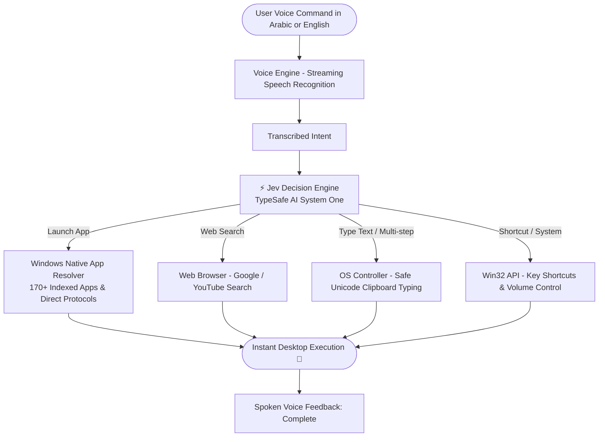

# ⚡ Jev Voice OS Agent

[📖 Read the Arabic Documentation (اقرأ النسخة العربية)](README_AR.md)

[](https://www.python.org/)
[-00f0ff.svg)](https://typesafe.ai)
[](https://microsoft.com)
[](#supported-commands)

> 🎙️ **An ultra-fast, bilingual (Arabic & English) voice-controlled desktop assistant for Windows. Powered entirely by the deterministic `Jev System One` decision model from TypeSafe AI, delivering sub-second intent resolution without relying on slow or expensive generative LLMs.**

---

## 🌟 Key Features

- **⚡ Sub-second Latency:** Deterministic decision-making in **200ms to 500ms** via `Jev System One`.
- **🗣️ Bilingual Speech Support:** Fluently understands both Arabic (Egyptian dialect & Modern Standard Arabic) and English.
- **🎯 In-App Control via Accessibility Tree (UIA):** Inspects, reads, clicks, and types into native Windows controls (Buttons, Text boxes, Menus, Tabs, Checkboxes) across desktop apps (Notepad, Chrome, VS Code, Rider, Office) with 0-latency local scanning.
- **🔍 Bilingual Phonetic App Resolver:** Solves cross-language phonetic pronunciation discrepancies (e.g., Arabic-transcribed English names like *"انتي جرافيتي"* ➡️ `Antigravity`, *"سبوتيفاي"* ➡️ `Spotify`, *"ديسكورد"* ➡️ `Discord`, *"رايدر"* ➡️ `JetBrains Rider`).
- **🚀 Instant Native Launching:** Directly resolves and executes over **170+ installed desktop applications and system protocols** without triggering web search or edge redirects.
- **💻 Dedicated IDE Support:** Out-of-the-box recognition and instant launching for developer IDEs including **JetBrains Rider**, **Visual Studio Community**, **VS Code**, **Cursor**, **Zed**, and **PyCharm**.
- **🏝️ Glassmorphic Dynamic Island UI:** Floating, draggable top-bar widget with real-time pulsing audio waveform visualizer and streaming speech detection.
- **🛑 Failsafe & Emergency Stop:** Emergency abort via the `ESC` key or moving the mouse pointer to any screen corner.
- **🔊 Natural Voice Feedback:** Seamless bilingual spoken responses powered by `Edge-TTS`.

---

## 🏗️ System Architecture



---

## 📂 Project Structure

```bash
arabic_voice_computer_use/
├── .env.example              # Environment variables template (no secrets)
├── .gitignore                # Excludes venv, logs, temp files, and media
├── README.md                 # Primary English documentation
├── README_AR.md              # Complete Arabic documentation
├── requirements.txt          # Python dependencies
├── run.bat                   # 1-click Windows startup script
├── main.py                   # Main application entry point
│
└── src/                      # Modular source package
    ├── __init__.py
    ├── config.py             # System settings & configuration loader
    │
    ├── core/                 # OS automation & resolver engines
    │   ├── os_controller.py  # Mouse, keyboard, clipboard & failsafe control
    │   ├── app_resolver.py   # Phonetic matching & Windows app indexing
    │   └── accessibility_scanner.py # UI Automation Tree & in-app control
    │
    ├── decision/             # AI Decision engine layer
    │   └── jev_engine.py     # TypeSafe AI Jev System One integration
    │
    ├── voice/                # Audio & Speech layer
    │   └── voice_engine.py   # Streaming STT & Edge-TTS voice engine
    │
    └── ui/                   # User interface layer
        └── dynamic_island.py # Glassmorphic Dynamic Island floating widget
```

---

## 🚀 Quick Start

### 1. Prerequisites
- Operating System: **Windows 10 / 11**
- Python: **Python 3.11 or higher**
- Working microphone

### 2. Clone Repository
```bash
git clone https://github.com/your-username/jev-arabic-voice-computer-use.git
cd jev-arabic-voice-computer-use
```

### 3. Configure API Credentials
Create a `.env` file in the root directory and add your [TypeSafe AI](https://typesafe.ai) API key:
```env
TYPESAFE_API_KEY=your_typesafe_api_key_here
DECISION_MODEL=jev-latest
VOICE_LANGUAGE=ar-EG
TTS_ENABLED=true
FAILSAFE_ENABLED=true
```

### 4. Run the Application
**Option A (1-Click Launch):**
- Double-click **`run.bat`** (automatically sets up virtual environment, installs dependencies, and launches the UI).

**Option B (Manual Terminal Launch):**
```bash
# Create and activate virtual environment
python -m venv venv
.\venv\Scripts\activate

# Install dependencies
pip install -r requirements.txt

# Launch application
python main.py
```

---

## 🗣️ Supported Commands

| Arabic Command | English Command | Executed Action |
| :--- | :--- | :--- |
| *"افتح انتي جرافيتي"* | *"Open Antigravity"* | Launches Google Antigravity |
| *"افتح رايدر"* / *"جيت برينز رايدر"* | *"Open Rider"* / *"Open JetBrains Rider"* | Directly launches JetBrains Rider 2026 |
| *"افتح فيجوال ستوديو كوميونيتي"* | *"Open Visual Studio"* | Directly launches Visual Studio Community |
| *"افتح سبوتيفاي"* | *"Open Spotify"* | Launches Spotify via native system protocol |
| *"افتح كلود"* | *"Open Claude"* | Launches Claude Desktop |
| *"افتح المفكرة واكتبلي تقرير اليوم"* | *"Open notepad and write daily report"* | Opens Notepad and pastes Arabic/English text |
| *"افتح اليوتيوب وشغل سورة الرحمن"* | *"Open YouTube and play Quran"* | Opens YouTube and searches query |
| *"افتح المتصفح وابحث عن أخبار الذكاء الاصطناعي"* | *"Search Google for AI news"* | Opens Chrome and searches Google |
| *"علي الصوت"* / *"وطي الصوت"* | *"Turn up volume"* / *"Mute"* | Controls system master volume directly |
| *"اقفل النافذة"* / *"أظهر سطح المكتب"* | *"Close window"* / *"Minimize all"* | Triggers OS shortcuts (`Alt+F4`, `Win+D`) |

---

## 🛡️ Safety & Controls

- **Emergency Stop Button:** Press the `ESC` key anytime to instantly abort mouse movement and key presses.
- **PyAutoGUI Fail-safe:** Moving the mouse cursor into any screen corner automatically halts all active operations.
