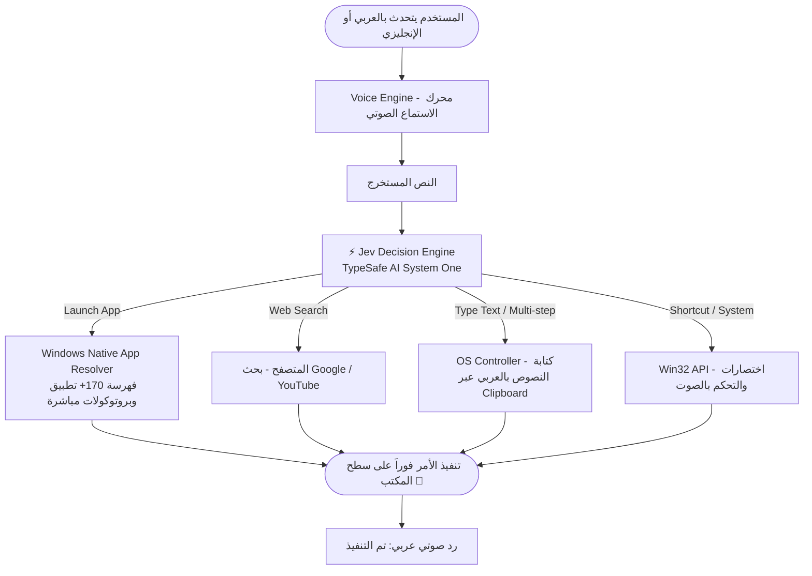

# ⚡ Jev Voice OS Agent (المساعد الصوتي للتحكم بالكمبيوتر)

[🌐 Switch to English Version (النسخة الإنجليزية)](README.md)

[](https://www.python.org/)
[-00f0ff.svg)](https://typesafe.ai)
[](https://microsoft.com)

> 🎙️ **مساعد صوتي ذكي فائق السرعة للتحكم بنظام ويندوز باللغة العربية (اللهجة المصرية والفصحى) والإنجليزية، يعتمد كلياً على نموذج اتخاذ القرار الفوري `Jev (TypeSafe AI System One)` بدون أي اعتماد على LLMs البطيئة أو خدمات خارجية ثقيلة.**

---

## 🌟 الميزات الرئيسية (Key Features)

- **⚡ اتخاذ قرار فوري (Sub-second Latency):** قرارات حتمية وسريعة جداً في أقل من **200 إلى 500 مللي ثانية** بفضل بنية `Jev System One`.
- **🗣️ دعم ثنائي اللغة (Bilingual Speech Support):** يفهم الأوامر الصوتية باللغة العربية (بالمصري والفصحى) وباللغة الإنجليزية بطلاقة.
- **🎯 التحكم داخل التطبيقات (In-App Control via Accessibility Tree):** قراءة والضغط على أزرار وقوائم وحقول البرامج النشطة (Notepad, Chrome, VS Code, Rider, Office) عبر واجهة Microsoft UI Automation بسرعة فائقة وبدون أي استهلاك للـ API.
- **🔍 محرك المطابقة الصوتية المعرب (Bilingual Phonetic Resolver):** يحل مشكلة نطق أسماء البرامج الإنجليزية بالحروف العربية (مثل *"انتي جرافيتي"*، *"سبوتيفاي"*، *"ديسكورد"*، *"رايدر"*) ويطابقها مع ملفاتها الأصلية مباشرة.
- **🚀 تشغيل البرامج الفوري (Direct Native Protocols):** دعم فتح أكثر من **170 تطبيق** مثبت على جهازك فوراً بدون البحث في المتصفح أو في شريط ويندوز.
- **💻 دعم مخصص لبيئات التطوير (IDEs):** تعرف فوري على بيئات التطوير مثل JetBrains Rider, Visual Studio Community, VS Code, Cursor, Zed, PyCharm.
- **🏝️ واجهة عائمة أنيقة (Dynamic Island UI):** شريط تفاعلي زجاجي مستوحى من Dynamic Island مع موجات صوتية حية (Live Waveform Visualizer).
- **🛑 حماية وأمان (Failsafe & Emergency Stop):** إيقاف طوارئ فوري بضغطة زر `ESC` أو بتحريك الماوس لأي زاوية من زوايا الشاشة.
- **🔊 رد صوتي طبيعي (Natural Arabic TTS):** ردود صوتية باللغة العربية عبر محرك `Edge-TTS`.

---

## 🏗️ المعمارية البرمجية (System Architecture)



---

## 📂 هيكل المشروع (Project Structure)

```bash
arabic_voice_computer_use/
├── .env.example              # نموذج ملف المتغيرات
├── .gitignore                # استبعاد ملفات الـ venv والـ logs والملفات المؤقتة
├── README.md                 # التوثيق الأساسي بالإنجليزية
├── README_AR.md              # التوثيق باللغة العربية
├── requirements.txt          # قائمة المكتبات المطلوبة
├── run.bat                   # ملف التشغيل السريع المباشر لويندوز
├── main.py                   # نقطة التشغيل الرئيسية للتطبيق
│
└── src/                      # الحزمة البرمجية الأساسية المنظمة
    ├── __init__.py
    ├── config.py             # إعدادات النظام وقراءة المتغيرات
    │
    ├── core/                 # محركات نظام التشغيل
    │   ├── os_controller.py  # التحكم بالماوس والكيبورد و Failsafe
    │   ├── app_resolver.py   # الفهرسة الصوتية للبرامج و IDEs
    │   └── accessibility_scanner.py # فحص عناصر البرامج عبر Accessibility Tree
    │
    ├── decision/             # محرك اتخاذ القرار
    │   └── jev_engine.py     # الربط مع Jev System One
    │
    ├── voice/                # محرك الصوت
    │   └── voice_engine.py   # الاستماع التدفقي والرد الصوتي
    │
    └── ui/                   # واجهة المستخدم
        └── dynamic_island.py # الـ Dynamic Island التفاعلية
```

---

## 🚀 التثبيت والتشغيل (Quick Start)

### 1. المتطلبات الأساسية
- نظام تشغيل: **Windows 10 / 11**
- إصدار بايثون: **Python 3.11 أو أعلى**
- ميكروفون متصل ويعمل

### 2. استنساخ المشروع (Clone Repository)
```bash
git clone https://github.com/your-username/jev-arabic-voice-computer-use.git
cd jev-arabic-voice-computer-use
```

### 3. إعداد البيئة ومتغيرات الـ API
قم بإنشاء ملف `.env` ووضع مفتاح API الخاص بك من [TypeSafe AI](https://typesafe.ai):
```env
TYPESAFE_API_KEY=your_typesafe_api_key_here
DECISION_MODEL=jev-latest
VOICE_LANGUAGE=ar-EG
TTS_ENABLED=true
FAILSAFE_ENABLED=true
```

### 4. التشغيل
**الخيار أ (بضغطة واحدة):**
- اضغط مرتين على ملف **`run.bat`** (يقوم بإنشاء البيئة وتثبيت الحزم وتشغيل الواجهة تلقائياً).

**الخيار ب (عبر الكونسول):**
```bash
# إنشاء وتفعيل البيئة الافتراضية
python -m venv venv
.\venv\Scripts\activate

# تثبيت المكتبات
pip install -r requirements.txt

# تشغيل البرنامج
python main.py
```

---

## 🗣️ أمثلة للأوامر المدعومة (Supported Commands)

| الأمر بالعربي | English Command | الإجراء المنفذ |
| :--- | :--- | :--- |
| *"افتح انتي جرافيتي"* | *"Open Antigravity"* | تشغيل تطبيق Google Antigravity فوراً |
| *"افتح رايدر"* / *"جيت برينز رايدر"* | *"Open Rider"* | تشغيل JetBrains Rider 2026 |
| *"افتح فيجوال ستوديو كوميونيتي"* | *"Open Visual Studio"* | تشغيل Visual Studio Community |
| *"افتح سبوتيفاي"* | *"Open Spotify"* | تشغيل تطبيق Spotify عبر بروتوكول النظام المباشر |
| *"افتح كلود"* | *"Open Claude"* | تشغيل تطبيق Claude Desktop |
| *"افتح المفكرة واكتبلي تقرير اليوم"* | *"Open notepad and write daily report"* | فتح Notepad وكتابة النص العربي مباشرة |
| *"افتح اليوتيوب وشغل سورة الرحمن"* | *"Open YouTube and play Quran"* | فتح اليوتيوب والبحث المباشر عن التلاوة |
| *"افتح المتصفح وابحث عن أخبار الذكاء الاصطناعي"* | *"Search Google for AI news"* | فتح Google Chrome والبحث الفوري |
| *"علي الصوت"* / *"وطي الصوت"* | *"Turn up volume"* / *"Mute"* | التحكم الفوري في مستوى صوت الويندوز |
| *"اقفل النافذة"* / *"أظهر سطح المكتب"* | *"Close window"* / *"Minimize all"* | تنفيذ اختصارات لوحة المفاتيح |

---

## 🛡️ الأمان والتحكم (Safety)

- **زر الطوارئ السريع:** اضغط على زر `ESC` لإلغاء أي حركة للماوس أو الكيبورد فوراً.
- **خاصية PyAutoGUI Fail-safe:** بمجرد تحريك الماوس إلى أي زاوية من زوايا الشاشة، يتوقف النظام أوتوماتيكياً.
