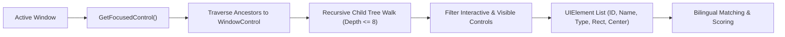

# Windows UI Automation & Accessibility Scanner

The **Accessibility Scanner** (`src/core/accessibility_scanner.py`) provides general-purpose, thread-safe inspection and interaction with any Windows desktop application using Microsoft UI Automation (UIA).

---

## 🎯 Why UI Automation Instead of Screen Scraping or Per-App Controllers?

1. **Zero Brittleness:** Does not break when window resolutions, window coordinates, or visual themes change.
2. **Universal Coverage:** Works across native Win32, WPF, WinUI/UWP, Electron, Chromium Embedded Framework (CEF), and Qt apps.
3. **Sub-Millisecond Traversal:** A full active window scan completes locally in ~10–30ms without taking screenshots or sending large image buffers across the network.
4. **Rich Semantic Metadata:** Exposes control names, control types (`Button`, `Edit`, `MenuItem`, `TabItem`), bounding rectangles, and automation IDs.

---

## 🔍 The Accessibility Scanner Pipeline



### `UIElement` Data Structure

```python
@dataclass
class UIElement:
    id: int
    name: str
    control_type: str
    automation_id: str
    class_name: str
    left: int
    top: int
    right: int
    bottom: int
    width: int
    height: int
    center_x: int
    center_y: int
    is_enabled: bool
    is_visible: bool
    value: Optional[str]
    raw_control: Any
```

---

## 🌐 Bilingual Control Matching & Arabic Normalization

When a user requests an action like `"دوس على زرار الكلمات"` or `"اضغط التالي"`:

1. **Text Normalization (`_normalize_text`):**
   - Strips tashkeel / diacritics (`[\u064B-\u0652]`).
   - Normalizes alefs (`[أإآٱ]` ➡️ `ا`), taa marbouta (`ة` ➡️ `ه`), and yaa (`ى` ➡️ `ي`).
   - Replaces phonetic variants (`الكلامات` ➡️ `الكلمات`, `البعدها` ➡️ `بعدها`).

2. **Synonym Expansion (`BILINGUAL_UI_SYNONYMS`):**
   - Expands Arabic colloquial and standard terms to English UI names (e.g., `"الكلمات"` ➡️ `["lyrics", "show lyrics", "كلمات"]`, `"نكست"` / `"التالي"` ➡️ `["next", "next track"]`, `"حفظ"` / `"سيف"` ➡️ `["save", "save as"]`).

3. **Multi-Factor Scoring:**
   - Evaluates exact matches, substring containment, token overlap, and control type weighting (Buttons/MenuItems get a 1.1x boost).
   - If confidence exceeds `0.40`, the element is accepted as a valid match.

---

## 🖱️ Two-Tiered Interaction Strategy

When interacting with a matched `UIElement`:

1. **Strategy 1: Native Programmatic Pattern (Primary):**
   - Attempts to invoke `element.raw_control.GetInvokePattern().Invoke()`.
   - For toggle/check buttons, uses `GetTogglePattern().Toggle()`.
   - For selectable items, uses `GetSelectionItemPattern().Select()`.
   - *Advantage:* Instant execution even if the button is partially obscured or not directly hovered by the cursor.

2. **Strategy 2: Hardware Coordinate Fallback (Secondary):**
   - Moves mouse smoothly to `(element.center_x, element.center_y)` and performs a hardware mouse click using PyAutoGUI.
