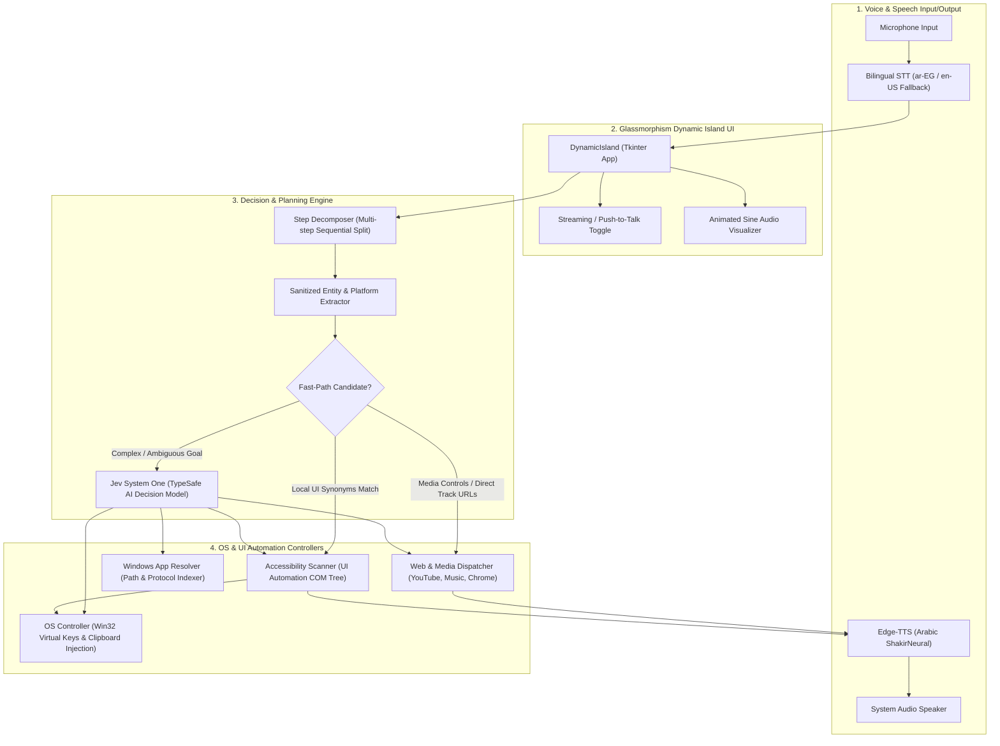

# System Architecture

This document details the architectural layout, communication pipelines, and lifecycle of voice commands within the **Jev Voice Computer Use** system.

---

## 🏗️ Layered Architecture Diagram



---

## 🔄 End-to-End Command Lifecycle

1. **Audio Ingestion (`src/voice/voice_engine.py`):**
   - User speaks into the microphone in either Egyptian Arabic, Modern Standard Arabic (MSA), or English.
   - `VoiceEngine.listen_command()` or `start_streaming_listen()` processes the audio stream with ambient noise calibration.
   - Primary recognition runs with `language="ar-EG"`. If `sr.UnknownValueError` occurs, it automatically falls back to `language="en-US"`.

2. **Sequential Step Decomposition (`src/decision/jev_engine.py`):**
   - The recognized string is passed to `_decompose_into_steps()`.
   - Sequential connectors (`وبعدين`, `ثم`, `وبعدها`, `and then`) and secondary verb conjuncts (`واكتب`, `وافتح`, `واحفظ`) split compound instructions into ordered atomic tasks (`[Step 1, Step 2, ...]`).
   - Playback modifiers (`وشغلها`, `وشغله`, `and play it`) are detected and tagged as `auto_play = True` on the target step.

3. **Entity Extraction & Dialect Sanitization:**
   - `_extract_clean_entities()` extracts the target platform (`youtube_music`, `spotify`, `youtube`, `google`, or `default`).
   - Strips conversational prepositions (`في`, `على`, `علي`, `غلي`, `من`, `عن`), action verbs (`سيرش`, `ابحث`, `شغل`, `افتح`), and entity labels (`اغنية`, `تراك`) to yield the pure target entity (e.g. `"اغيب"`).

4. **Multi-Level Dispatching:**
   - **Level 1 (Fast-Path Multimedia):**
     - Hardware multimedia controls (`playpause`, `nexttrack`, `prevtrack`) are sent directly via Win32 Virtual Key codes (`0xB0`, `0xB1`, `0xB3`).
     - Direct YouTube / YouTube Music track resolution: Queries top video ID in <1s and opens `music.youtube.com/watch?v={id}` directly.
     - Spotify Quick Search: Focuses Spotify window and triggers `Ctrl + K` ➡️ query paste ➡️ `Enter`.
   - **Level 2 (Fast-Path UI Synonyms):**
     - Scans active window with `AccessibilityScanner.scan_active_window()`.
     - Matches user query against bilingual synonyms dictionary (`BILINGUAL_UI_SYNONYMS`).
     - Triggers programmatic invoke or coordinate click on the matched control.
   - **Level 3 (Jev System One AI Model):**
     - If not resolved locally, sends the current window title, top visible controls, and goal to TypeSafe AI's `client.system_one()`.
     - Returns strict classified action (`launch_app`, `in_app_search`, `click_ui_element`, `type_text`, `keyboard_shortcut`, etc.) with sub-second response time.

5. **Safe Unicode Execution & TTS Feedback:**
   - Text is injected using clipboard pasting (`Ctrl + V`) to preserve Arabic Unicode characters without corrupting text buffers.
   - Execution status is updated in the Dynamic Island UI and spoken via Edge-TTS (`ar-EG-ShakirNeural`).

---

## 🧵 Threading & COM Apartment Model

```
+-----------------------------------------------------------------------+
| Main UI Thread (Tkinter Event Loop)                                   |
| - Manages Glassmorphism window, drag events, and Sine visualizer      |
+-----------------------------------------------------------------------+
                                  |
                                  | Launches worker thread on voice input
                                  v
+-----------------------------------------------------------------------+
| Background Worker Thread (threading.Thread, daemon=True)              |
| - with auto.UIAutomationInitializerInThread():                         |
|   * Initializes COM Apartment (MTA/STA) for UIAutomationCore.dll      |
|   * Executes JevDecisionEngine.execute_goal()                         |
|   * Dispatches Win32 and PyAutoGUI events                             |
|   * Sends status callbacks back to Tkinter UI                         |
+-----------------------------------------------------------------------+
```

Without `auto.UIAutomationInitializerInThread()`, calling `uiautomation` inside a non-main Python thread triggers `[WinError -2147221008] CoInitialize has not been called`. The `@ensure_com_initialized` decorator guarantees safe execution across all entrypoints.
