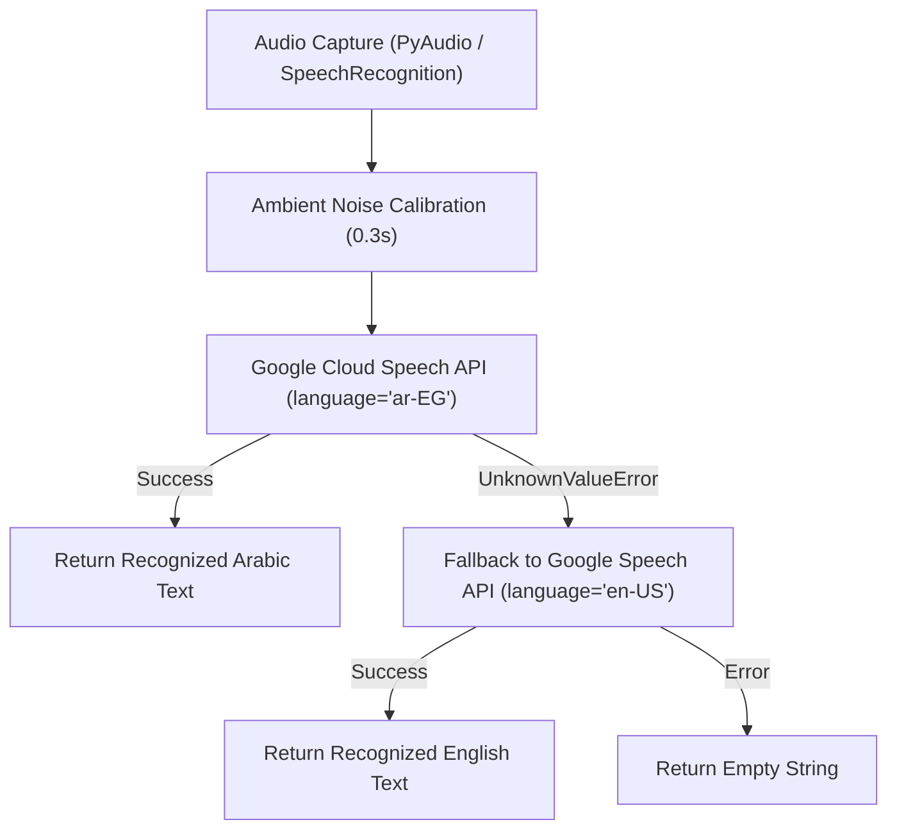

# Voice & Speech Pipeline

The **Voice Engine** (`src/voice/voice_engine.py`) and UI audio subsystem provide real-time speech recognition (STT), text-to-speech synthesis (TTS), and visual waveform feedback.

---

## 🎙️ Speech Recognition (STT) Architecture

### Dual-Language Adaptive Fallback

### Recognition Modes

1. **Push-to-Talk (`listen_command`):**
   - Triggered by clicking the 🎙️ button on the Dynamic Island.
   - Listens for up to 8 seconds of speech with a 15-second phrase limit.
   - Auto-calibrates energy threshold to ambient noise (`energy_threshold = 300`, `dynamic_energy_threshold = True`).

2. **Hands-Free Live Streaming (`start_streaming_listen`):**
   - Triggered by toggling the "Enable Streaming" mode on the UI top bar.
   - Listens continuously in a background worker thread (`recognizer.listen_in_background()`).
   - Dispatches chunks to `_on_live_speech_chunk()` whenever valid speech pauses are detected (`pause_threshold = 1.4s`).

---

## 🔊 Text-To-Speech (TTS) Synthesis

- **Engine:** Microsoft Edge-TTS (`edge_tts`).
- **Voice Model:** `ar-EG-ShakirNeural` (natural, high-clarity Egyptian Arabic neural voice).
- **Playback:** Asynchronous streaming via Pygame Mixer (`pygame.mixer.music.load()`) in a dedicated daemon thread to prevent UI freezing.

---

## 🌊 Dynamic Island Visualizer Subsystem

- **Implementation:** Tkinter Canvas 5-bar animated sinusoidal visualizer.
- **Wave Function:**
  $$y = \text{mid\_y} \pm \left( A \cdot |\sin(\text{phase} + i \cdot 0.8)| + \text{base} \right)$$
- **State Colors:**
  - `idle`: Cyan (`#00f0ff`)
  - `listening`: Crimson Red (`#ff0055`)
  - `deciding`: Amber Gold (`#ffb703`)
  - `executing`: Emerald Green (`#00ff88`)
  - `stopped`: Red-Orange (`#ff4d6d`)
